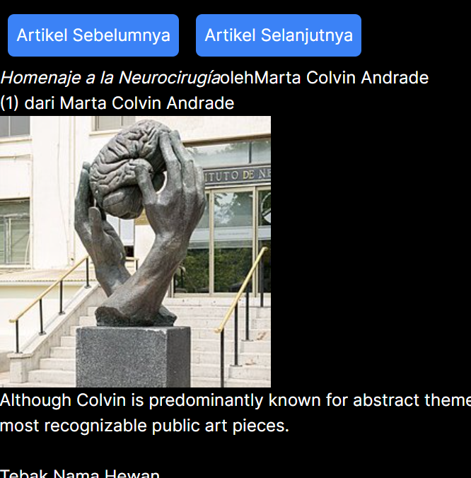
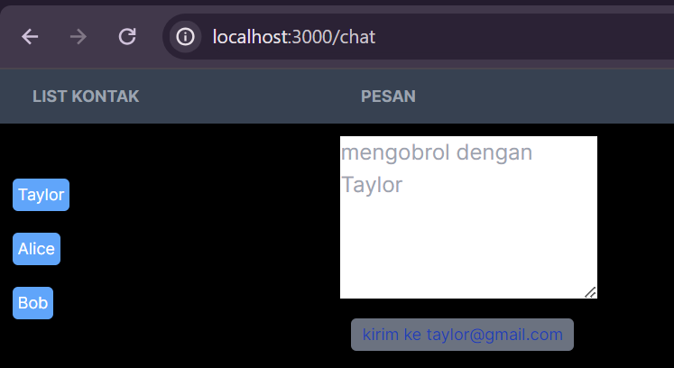

|  | Pemrograman Berbasis Framework |
|--|--|
| NIM | 2141720248 |
| Nama | Zhubair Abhel |
| Kelas | TI - 3C |

### Jawaban
1. Jika tombol "Artikel Selanjutnya" ditekan sebanyak 5 kali (atau melebihi jumlah total artikel), pada implementasi yang ada, akan terjadi error karena indeks index akan melampaui panjang sculptureList. Ini akan menyebabkan akses ke indeks yang tidak valid dalam sculptureList, yang akan menghasilkan undefined.

2. function handlePrevClick(){
        setIndex(PrevIndex => (PrevIndex - 1 + sculptureList.length) % sculptureList.length)
    }

3.  function handlePrevClick(){
        setIndex(PrevIndex => (PrevIndex - 1 + sculptureList.length) % sculptureList.length)
    }

### Jawaban Soal Praktikum 5
1. tidak ada perbedaan untuk fungsinya hanya berbeda yang pertama menggunakan state Fullname dan yang kedua hanya menggunakan variable biasa
2. karena hal ini membuat state redundan, dan bisa membuat kesalahan/bug pada aplikasi react/nextjs. Untuk itu, state fullName bisa dihapus dan digantikan variable biasa.

### Jawaban Soal Praktikum 6

1. Untuk memberikan React sebuah identitas unik untuk setiap elemen dalam daftar yang di-render. 
2. Digunakan untuk memberikan identifier unik kepada setiap elemen dalam daftar komponen. Dalam konteks ini, key digunakan untuk membantu React dalam membedakan antara komponen-komponen <Chat> yang berbeda di dalam daftar yang mungkin di-render oleh React.

